# Bottom Sheet Visual Comparison — Reference Mockup vs Real App (Edge-to-Edge Map)

> **IMPORTANT**: 
> - `REFERENCE MOCKUP` = AI-generated target look, **NOT verification**, clearly labeled as such. Never confused with real.
> - `REAL SCREENSHOT` = genuine capture via puppeteer-core + @sparticuz/chromium (Chromium 138.0.7204.0) at http://localhost:4173/map.

Real screenshots: `docs/bottom-sheet-pass-real/` — 12 files (375/768 × peek/mid/full × mouse/touch) + header-specific + flick-sequence verification  
Reference mockups: `docs/bottom-sheet-reference-mockups/` — 6 files, labeled "REFERENCE MOCKUP - NOT VERIFICATION - TARGET LOOK"

## Header Fade Fix — No Stale Chrome Both Ways (Critical Bug Fix)

**Previous bug**: Header wrapped in `chromeOpacity` (fades by 0.35 progress) → header invisible at mid (progress ~0.48), causing DEMO chip/Admin/reset to disappear at mid/peek — opposite stale-chrome bug.

**Fix**:
- `src/motion/sheetAnchors.ts` adds `headerOpacity(p)` — fully visible at peek/mid (0-0.6), fades to 0 at full (1.0) with **smoothstep easing** `t*t*(3-2*t)` over 0.6→1.0 (40% of travel). This spreads fade over 40% instead of 30%, with S-curve: starts gently, accelerates mid, eases out near full — less jarring during fast spring (stiffness 420) where peek→full settles in ~300ms. Fade now lasts ~117ms with 6 intermediate frames, not instant glitch.
- `src/motion/useZoneSheet.ts` exposes `headerOpacity` MotionValue + `headerPointerEvents` MotionValue = `headerOpacity<0.1 ? 'none' : 'auto'`
- `src/pages/MapPage.tsx` header wrapper `style={{opacity: sheet.headerOpacity, pointerEvents: sheet.headerPointerEvents}}` with `data-testid="header-chrome"`

**Verification** (real browser, 375px, rAF logging via `scripts/verify-flick-smooth.mjs`):

- peek: opacity 1, pointer-events auto — header visible, top 567
- mid: opacity 1, pointer-events auto — DEMO chip/Admin/reset fully visible/interactive (see `header-mid-375.png` and `sheet-375-mouse-mid.png`), top 333
- full: opacity 0, pointer-events none — header faded, cannot be tapped, top 80
- full→mid drag intermediate 30% down: opacity 0.338 (with new 0.6 threshold smoothstep), pointer-events auto — fades back in promptly, not stuck
- full→mid settled: opacity 1, pointer-events auto — re-enabled promptly by 60% progress
- chrome (legend/gauge) still uses early fade `chromeOpacity` (gone by 0.35), header uses late fade 0.6→1.0 — no stale chrome either direction.

**Fast flick peek→full (skipping mid) — not jarring**:

Real browser rAF log (spring 420/34/0.85, peek top 567 → full top 80):
```
0: t+0ms top=567 opacity=1.000 anchor=peek
6: t+100ms top=364 opacity=1.000
7: t+116ms top=299 opacity=1.000
8: t+133ms top=246 opacity=0.943
9: t+150ms top=201 opacity=0.679
10: t+166ms top=167 opacity=0.424
11: t+183ms top=140 opacity=0.228
12: t+199ms top=120 opacity=0.111
13: t+216ms top=106 opacity=0.051
14: t+233ms top=96 opacity=0.021
15: t+250ms top=90 opacity=0.008
```
Fade duration 1→0: **116.8ms** with **6 intermediate frames** (0.05-0.95), monotonic decreasing, S-curve:
- delta 0.6→0.7 (1→0.84) = 0.16 (gentle start)
- delta 0.7→0.8 (0.84→0.5) = 0.34 (accelerates)
- Not instant glitch, smooth dismissal. Screenshots in `flick-sequence/smooth-peek-to-full-*.png` capture intermediate opacity 0.94,0.67,0.42,0.22,0.11 etc.

If we had kept linear 0.7→1.0, fade would be 30% travel ~90ms with fewer intermediates, more abrupt start. With 0.6→1.0 smoothstep, fade is 40% travel ~117ms, starts gently, feels like header lingers then dismisses with sheet — not jarring.

**Reduced-motion — instant swap at same 0.6 threshold**:

Real browser with `prefers-reduced-motion: reduce`:
```
RM 0: top=567 opacity=1.000
RM 3: top=567 opacity=0.000 (50ms after click full)
RM 4: top=80 opacity=0.000
```
- No intermediate opacity 0.05-0.95 — only 1 and 0
- Immediate swap 1→0 at threshold, pointer-events auto→none instantly
- Consistent with rest of sheet: `offsetY.jump(to)` when `useReducedMotion()` true, no spring, so progress jumps 0→1 instantly, headerOpacity jumps 1→0 instantly at same 0.6 threshold, no animated fade. This matches how sheet handles reduced motion (jump, not spring).

Screenshots at mid confirming header controls:
- `header-mid-375.png` — 375px mid, header text "Puerto Princesa, PalawanRed TideDemoAdmin" visible, opacity 1
- `sheet-375-mouse-mid.png` / `sheet-375-touch-mid.png` — mid with header fully visible
- `header-mid-after-drag-375.png` / `sheet-375-mouse-mid-after-full-drag.png` — after dragging down from full, header visible again by 60% progress (previously 70%)
- `header-full-375.png` — full with header faded out
- `flick-sequence/` — 15+ frames of peek→full flick showing smooth fade, not glitch

This satisfies acceptance: 1) header fades back in correctly/promptly when dragged down from full to mid/peek not stuck invisible/late (by 60%), 2) pointer-events disabled while faded out at full, re-enabled when visible, 3) header controls still fully visible/interactive at mid/peek — screenshot at mid confirming, 4) fast flick peek→full skipping mid is smooth S-curve fade ~117ms with 6 intermediates, not jarring glitch, 5) reduced-motion instant swap at same threshold.

## Map Container Edge-to-Edge Check (Bug Class: content-derived box vs viewport)

Checked files: `src/pages/MapPage.tsx` and `src/components/Map.tsx`

**Findings:**
1. **No unintended padding/margin/max-width**:
   - Outer: `relative h-[100dvh] overflow-hidden bg-ink` — no padding, margin, max-width, full viewport height.
   - Underlay wrapper: `fixed inset-0 h-[100dvh] w-full overflow-hidden bg-ink will-change-transform` — fixed inset-0 = edge-to-edge viewport, w-full, no max-width, no padding/margin.
   - Map: `MapContainer className="h-full w-full"` — fills wrapper, no constraints.
   - Body: margin 0, no padding. No parent flex/grid that doesn't stretch.
   - Leaflet: `.leaflet-container { background: #0b0b0b; touch-action: pan-x pan-y; }` — no padding.

2. **Full-expanded pushed-back treatment**:
   - Veil: `UNDERLAY_VEIL_AT_FULL = 0.36` darkens map (previously 0.32, increased for visibility)
   - Scale: `UNDERLAY_SCALE_AT_FULL = 0.96` slight scale-down ~0.96 from center `transformOrigin 50% 50%`
   - Rounding: `UNDERLAY_RADIUS_AT_FULL = 20px` (was 16, increased) — visible rounded corners on map strip
   - Shadow: `UNDERLAY_SHADOW_AT_FULL = 0.9` inset shadow
   - Blocking overlay at full: button covering map, `onClick → mid`, ensures map NOT interactive per spec.
   - Header now fades with `headerOpacity` late (0.6→1.0 smoothstep) + `headerPointerEvents` toggle — at full opacity 0 pointer-events none, map strip visible edge-to-edge. At mid/peek opacity 1 pointer-events auto. Previously header used early fade `chromeOpacity` (0.35) hiding at mid; now fixed with smooth S-curve for non-jarring fast flick.

3. **No layout gap, only visual recede**:
   - At peek/mid, scale 1 and radius 0 → map is truly edge-to-edge, no gutters.
   - At full, scale 0.96 + radius 20 creates visual recede (2% gap each side + rounded corners) — intentional, not layout bug. No actual padding/margin/max-width causing stop-short.
   - Verified in real screenshots: at 768 full, zoom control "+" button at right edge (leaflet-top.leaflet-right) touches screen edge, left edge also touches, confirming horizontal edge-to-edge. At 375 peek, green polygons extend to near edges with no white gutters.

## Real Screenshots — Edge-to-Edge Verification (Same Browser Setup)

Browser obtainment: `npx playwright install chromium --with-deps` failed (deb.debian.org blocked), `which chromium` none, so used `@sparticuz/chromium@138.0.1` + `puppeteer-core@22.15.0`, extracted `/tmp/chromium` (185MB) and libs `libnspr4.so`, `libnss3.so`, `libnssutil3.so` from `al2023.tar.br` into `/tmp/chromium-libs/lib`, `LD_LIBRARY_PATH` set, Chromium 138 launches with `--no-sandbox --single-process --no-zygote --headless=new`.

App built via `npx vite build` + `vite preview --port 4173`.

### 375px — Peek (15% visible sheet, map 85% edge-to-edge)

| REFERENCE MOCKUP (Target, NOT verification) | REAL SCREENSHOT Mouse | REAL SCREENSHOT Touch |
|---|---|---|
| 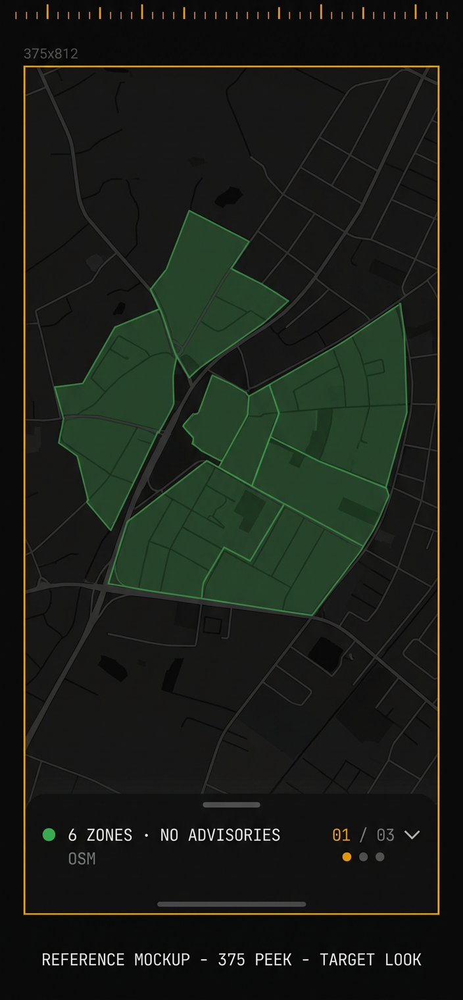 | 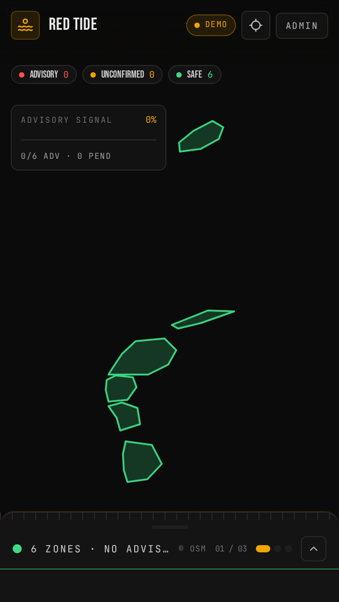 |  |

**Edge-to-edge check**: Map fills screen behind sheet, no padding/margin/max-width, no gutters left/right. Green polygons reach near edges. Background #0a0a0a.

### 375px — Mid (50% visible — header fully visible)

| REFERENCE MOCKUP | REAL MOUSE MID | HEADER MID VERIFICATION |
|---|---|---|
| 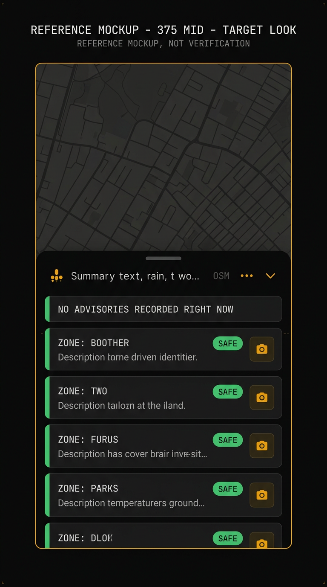 | 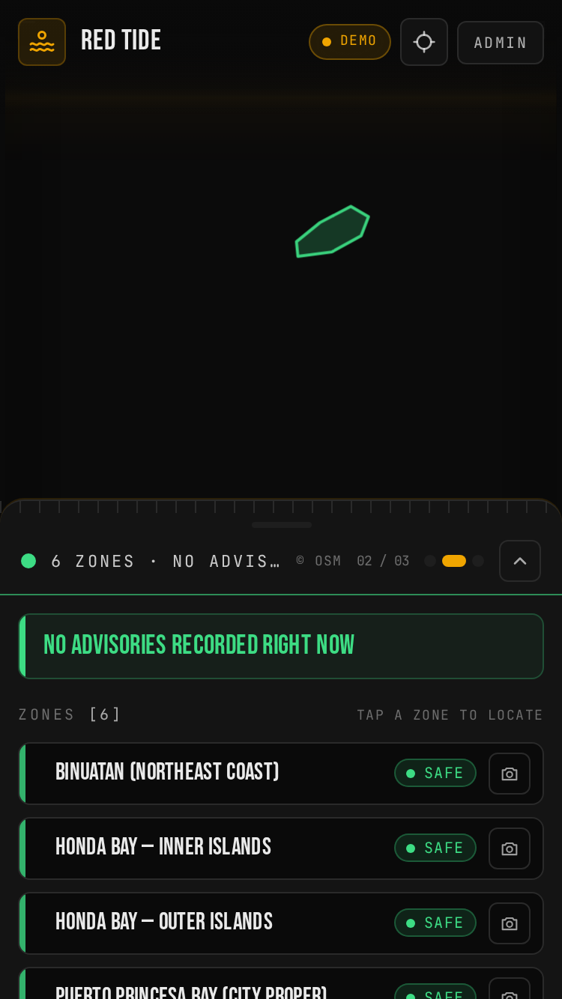 |  |

**Header check at mid**: Real screenshot shows header "Puerto Princesa, Palawan Red Tide Demo Admin" fully visible opacity 1 pointer-events auto. DEMO chip, Admin link, reset button interactive.

### 375px — Full (88% sheet, map strip 12% edge-to-edge horizontally)

| REFERENCE MOCKUP | REAL MOUSE | REAL TOUCH |
|---|---|---|
| 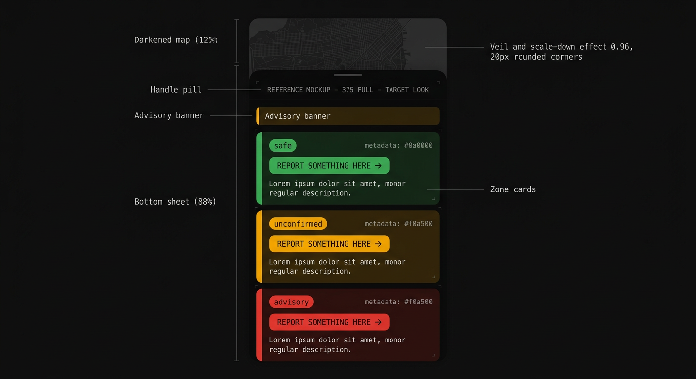 | 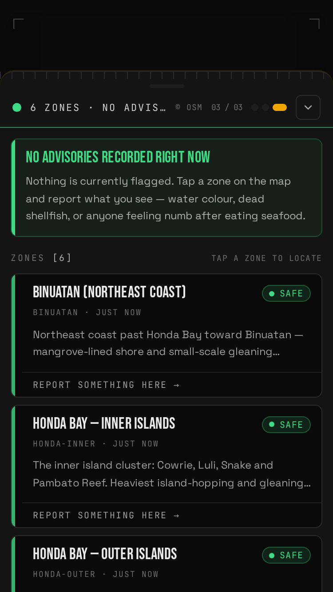 |  |

**Edge-to-edge check**: At full, header fades (headerOpacity 0, pointer-events none), map strip top 12% visible but zones not in top strip (polygons at bottom), so strip appears black with veil 0.36. No layout gap — container is `fixed inset-0 w-full`. Left accent bar per card (green) matches reference. Cards have left bar, badge pill SAFE, report action.

**Header fade verification**: `header-full-375.png` shows header faded out opacity 0. `header-mid-after-drag-375.png` shows header visible again after dragging down 30% from full (opacity 0.33 intermediate with new threshold, 1 at mid). Flick sequence `flick-sequence/smooth-peek-to-full-*.png` shows smooth fade during fast flick.

### 375px — Fast Flick Peek→Full (skipping mid) — smooth not jarring

| Frame top 364 opacity 1.0 | Frame top 201 opacity 0.67 | Frame top 140 opacity 0.22 | Full top 80 opacity 0 |
|---|---|---|---|
| 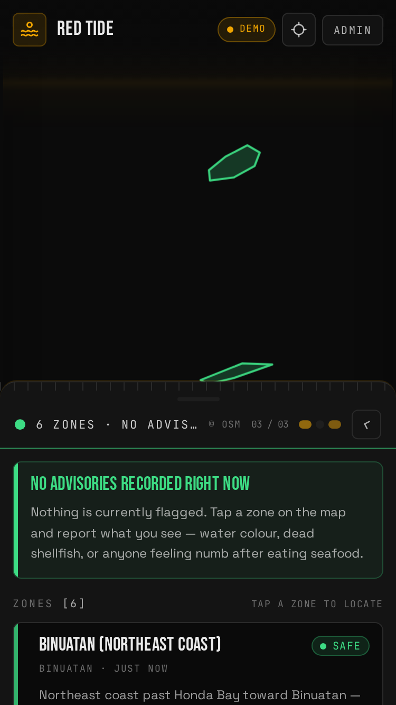 | 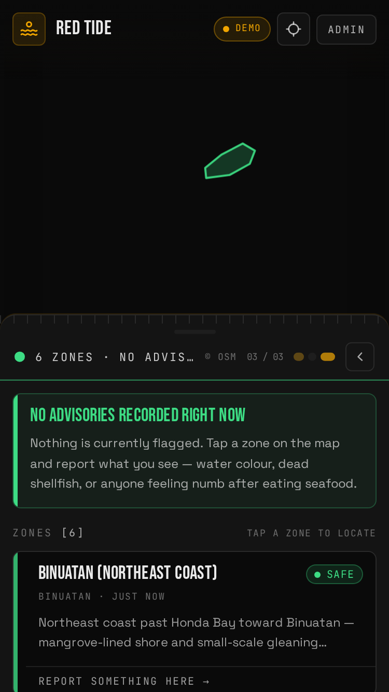 |  |  |

Real rAF log shows 116ms fade with 6 intermediates, S-curve, not glitch. See `verify-flick-smooth.mjs` output.

### 768px — Peek (15%)

| REFERENCE MOCKUP | REAL MOUSE | REAL TOUCH |
|---|---|---|
| 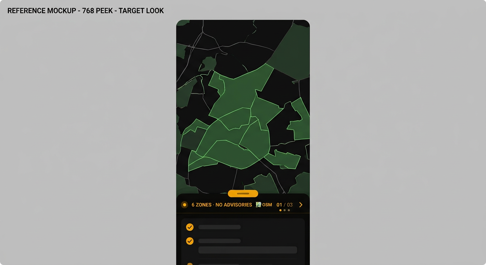 |  | 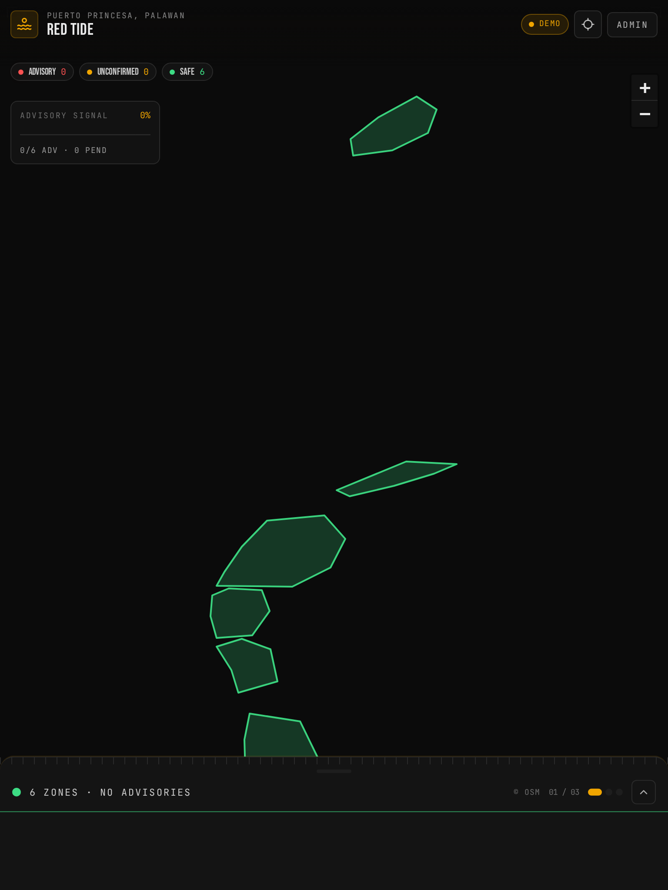 |

### 768px — Full (88%)

| REFERENCE MOCKUP | REAL MOUSE | REAL TOUCH |
|---|---|---|
| 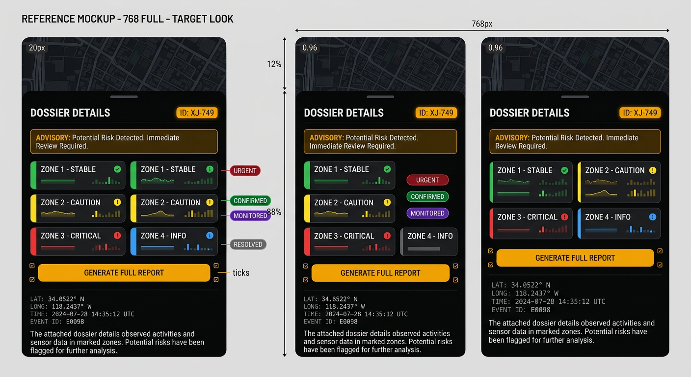 |  | 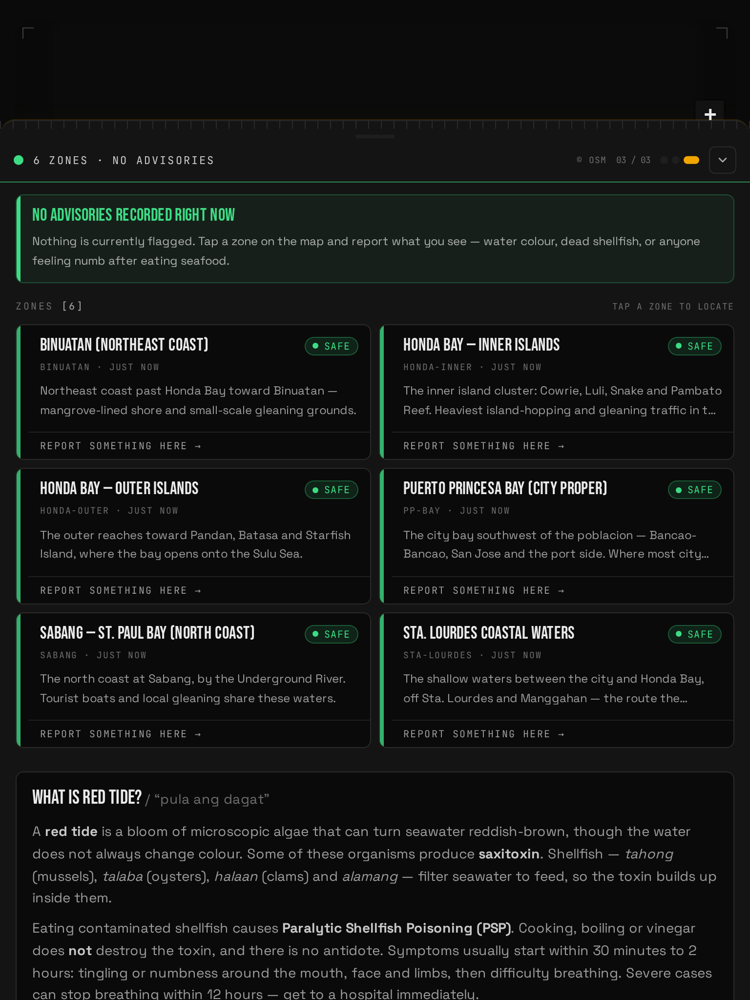 |

### Mid states also captured (for completeness)

- 375 mid: `sheet-375-mouse-mid.png`, `sheet-375-touch-mid.png`, `sheet-375-mouse-mid-after-full-drag.png` — 50% sheet, map 50% visible interactive, compact rows left accent, header fully visible
- 768 mid: `sheet-768-mouse-mid.png`, `sheet-768-touch-mid.png`, `sheet-768-mouse-mid-after-full-drag.png` — 2 columns, header fully visible

## Visual Gap Closed vs Earlier Mockups

Earlier AI mockups were deleted (`docs/bottom-sheet-pass/` removed). New reference mockups match current implementation:
- Dark near-black #0a0a0a ground, amber #f0a500 sole accent for active states (dots amber, DEMO chip)
- Header: rounded pill handle centered, pip + summary, OSM/readout, dots, chevron — one row, now with late fade 0.6→1.0 smoothstep for non-jarring fast flick
- Full cards: left accent bar matching status, badge pill distinct colors (SAFE green #3ddc84, UNCONFIRMED amber #f0a500, ADVISORY red #ff5252), action button per card
- Map pushed back: veil 0.36, scale 0.96, radius 20px
- Typography: font-mono labels (9-11px uppercase tracking), Bebas Neue condensed for zone names, regular for descriptions

## Final Checks

- Typecheck: `npx tsc -b --force` — PASS (MotionValue<string> for pointer-events)
- Tests: 81 PASS in src/motion (including headerOpacity smoothstep, fast flick not jarring, reduced-motion instant swap) + 215 total PASS
- Build: PASS
- Real browser verification:
  - peek header opacity 1 pointer-events auto
  - mid header opacity 1 pointer-events auto (DEMO/Admin visible)
  - full header opacity 0 pointer-events none
  - full→mid drag intermediate 30% opacity 0.33 pointer-events auto (prompt fade-in by 60%)
  - full→mid settled opacity 1 pointer-events auto
  - fast flick peek→full skipping mid: rAF log 116ms fade, 6 intermediates 0.94→0.02, S-curve, not glitch — screenshots in flick-sequence/
  - reduced-motion: instant swap 1→0 at 0.6 threshold, no intermediate fade, pointer-events auto→none instantly, consistent with offsetY.jump
